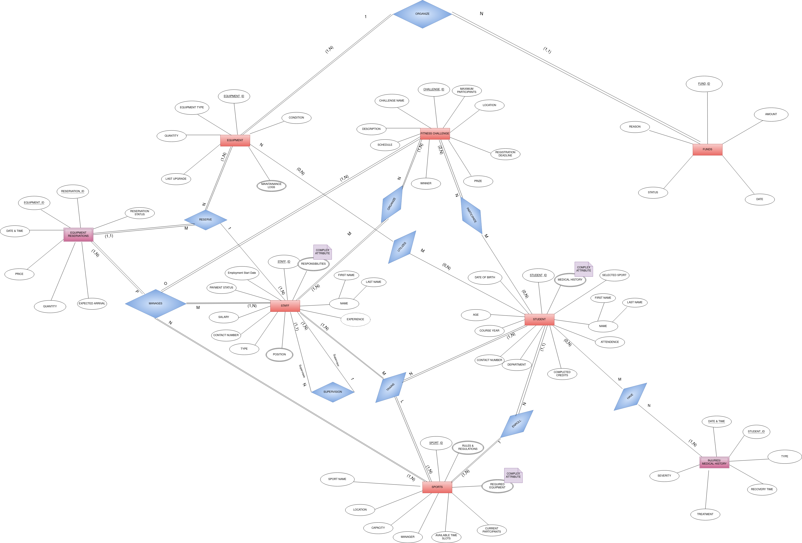

<h3 align="center"> Project Phase-2</h3>

<h2 align="center"> Team: Samachara_Kendhram</h1>

**Team Members:**
- Dileepkumar Adari (2022101007)
- Revanth Reddy (2022101049)
- Keshav (2022101123)
- Ritvik (2022111034)

# ER Diagram:

  

# CHANGES MADE:
1) In relationship "ENROLL" :
- Present relationship :  "Students (0, N) enroll in (1, 1) Fitness Challenges"
- Updated Relationship :  "Students (0, N) enroll in (1, 1) Sports"

2) In relationship "Utilize":
- Present relationship : "Students and staff (0, N) utilize (0, N) Equipment"
- Updated Relationship : "Students (0, N) utilize (0, N) Equipment"

3) In relationship No.4 -> "Participate"
- There is no entity named Event so we are removing this Relationship.

4) In relationship "ORGANIZE":
- Present relationship : "Staff members (1, N) organize (1, N) Events"
- Updated Relationship : "Staff members (1, N) organize (1, N) Fitness Challenge"

5) NEWLY ADDED RELATIONSHIP : "ALLOCATE":
- Relationship : "Funds (1,N) allocated for (1,1) Equipment"
- Degree of Relationship : 2
- CR -> N:1
